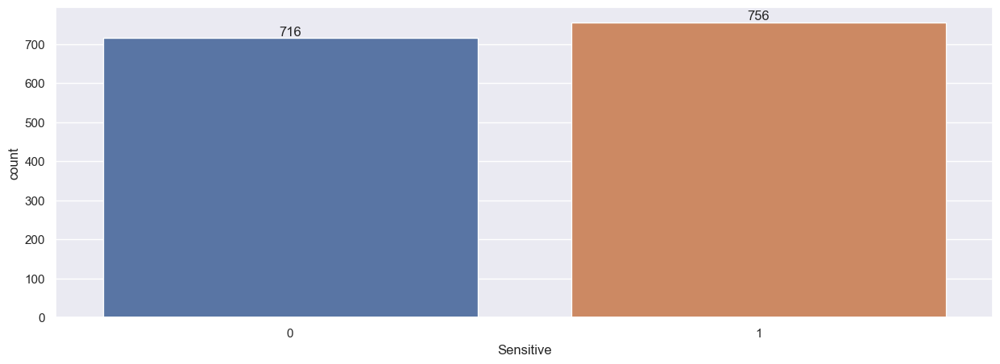

```python
import numpy as np # arrays work
import pandas as pd # data frame as table work
import matplotlib.pyplot as plt  # charts
%matplotlib inline
import seaborn as sns # graphs 
```


```python
df=pd.read_csv(r"C:\Users\hellw\Downloads\DataSet\cosmetics.csv") # pandas read
```


```python
df.shape # rows and columns
```


    (1472, 11)


```python
df.head(10) #first 5 rows
```


<div>
<style scoped>
    .dataframe tbody tr th:only-of-type {
        vertical-align: middle;
    }

    .dataframe tbody tr th {
        vertical-align: top;
    }

    .dataframe thead th {
        text-align: right;
    }
</style>
<table border="1" class="dataframe">
  <thead>
    <tr style="text-align: right;">
      <th></th>
      <th>Label</th>
      <th>Brand</th>
      <th>Name</th>
      <th>Price</th>
      <th>Rank</th>
      <th>Ingredients</th>
      <th>Combination</th>
      <th>Dry</th>
      <th>Normal</th>
      <th>Oily</th>
      <th>Sensitive</th>
    </tr>
  </thead>
  <tbody>
    <tr>
      <th>0</th>
      <td>Moisturizer</td>
      <td>LA MER</td>
      <td>Crème de la Mer</td>
      <td>175</td>
      <td>4.1</td>
      <td>Algae (Seaweed) Extract, Mineral Oil, Petrolat...</td>
      <td>1</td>
      <td>1</td>
      <td>1</td>
      <td>1</td>
      <td>1</td>
    </tr>
    <tr>
      <th>1</th>
      <td>Moisturizer</td>
      <td>SK-II</td>
      <td>Facial Treatment Essence</td>
      <td>179</td>
      <td>4.1</td>
      <td>Galactomyces Ferment Filtrate (Pitera), Butyle...</td>
      <td>1</td>
      <td>1</td>
      <td>1</td>
      <td>1</td>
      <td>1</td>
    </tr>
    <tr>
      <th>2</th>
      <td>Moisturizer</td>
      <td>DRUNK ELEPHANT</td>
      <td>Protini™ Polypeptide Cream</td>
      <td>68</td>
      <td>4.4</td>
      <td>Water, Dicaprylyl Carbonate, Glycerin, Ceteary...</td>
      <td>1</td>
      <td>1</td>
      <td>1</td>
      <td>1</td>
      <td>0</td>
    </tr>
    <tr>
      <th>3</th>
      <td>Moisturizer</td>
      <td>LA MER</td>
      <td>The Moisturizing Soft Cream</td>
      <td>175</td>
      <td>3.8</td>
      <td>Algae (Seaweed) Extract, Cyclopentasiloxane, P...</td>
      <td>1</td>
      <td>1</td>
      <td>1</td>
      <td>1</td>
      <td>1</td>
    </tr>
    <tr>
      <th>4</th>
      <td>Moisturizer</td>
      <td>IT COSMETICS</td>
      <td>Your Skin But Better™ CC+™ Cream with SPF 50+</td>
      <td>38</td>
      <td>4.1</td>
      <td>Water, Snail Secretion Filtrate, Phenyl Trimet...</td>
      <td>1</td>
      <td>1</td>
      <td>1</td>
      <td>1</td>
      <td>1</td>
    </tr>
    <tr>
      <th>5</th>
      <td>Moisturizer</td>
      <td>TATCHA</td>
      <td>The Water Cream</td>
      <td>68</td>
      <td>4.2</td>
      <td>Water, Saccharomyces/Camellia Sinensis Leaf/Cl...</td>
      <td>1</td>
      <td>0</td>
      <td>1</td>
      <td>1</td>
      <td>1</td>
    </tr>
    <tr>
      <th>6</th>
      <td>Moisturizer</td>
      <td>DRUNK ELEPHANT</td>
      <td>Lala Retro™ Whipped Cream</td>
      <td>60</td>
      <td>4.2</td>
      <td>Water, Glycerin, Caprylic/ Capric Triglyceride...</td>
      <td>1</td>
      <td>1</td>
      <td>1</td>
      <td>1</td>
      <td>0</td>
    </tr>
    <tr>
      <th>7</th>
      <td>Moisturizer</td>
      <td>DRUNK ELEPHANT</td>
      <td>Virgin Marula Luxury Facial Oil</td>
      <td>72</td>
      <td>4.4</td>
      <td>100% Unrefined Sclerocraya Birrea (Marula) Ker...</td>
      <td>1</td>
      <td>1</td>
      <td>1</td>
      <td>1</td>
      <td>0</td>
    </tr>
    <tr>
      <th>8</th>
      <td>Moisturizer</td>
      <td>KIEHL'S SINCE 1851</td>
      <td>Ultra Facial Cream</td>
      <td>29</td>
      <td>4.4</td>
      <td>Water, Glycerin, Cyclohexasiloxane, Squalane, ...</td>
      <td>1</td>
      <td>1</td>
      <td>1</td>
      <td>1</td>
      <td>1</td>
    </tr>
    <tr>
      <th>9</th>
      <td>Moisturizer</td>
      <td>LA MER</td>
      <td>Little Miss Miracle Limited-Edition Crème de l...</td>
      <td>325</td>
      <td>5.0</td>
      <td>Algae (Seaweed) Extract, Mineral Oil, Petrolat...</td>
      <td>0</td>
      <td>0</td>
      <td>0</td>
      <td>0</td>
      <td>0</td>
    </tr>
  </tbody>
</table>
</div>


```python
df.info() #
```

    <class 'pandas.core.frame.DataFrame'>
    RangeIndex: 1472 entries, 0 to 1471
    Data columns (total 11 columns):
     #   Column       Non-Null Count  Dtype  
    ---  ------       --------------  -----  
     0   Label        1472 non-null   object 
     1   Brand        1472 non-null   object 
     2   Name         1472 non-null   object 
     3   Price        1472 non-null   int64  
     4   Rank         1472 non-null   float64
     5   Ingredients  1472 non-null   object 
     6   Combination  1472 non-null   int64  
     7   Dry          1472 non-null   int64  
     8   Normal       1472 non-null   int64  
     9   Oily         1472 non-null   int64  
     10  Sensitive    1472 non-null   int64  
    dtypes: float64(1), int64(6), object(4)
    memory usage: 126.6+ KB
    


```python
# drop function to delete rows df.drop([' ',' '],axis=1,inplace=True )
```


```python
pd.isnull(df) # false means that there is some value 
```


<div>
<style scoped>
    .dataframe tbody tr th:only-of-type {
        vertical-align: middle;
    }

    .dataframe tbody tr th {
        vertical-align: top;
    }

    .dataframe thead th {
        text-align: right;
    }
</style>
<table border="1" class="dataframe">
  <thead>
    <tr style="text-align: right;">
      <th></th>
      <th>Label</th>
      <th>Brand</th>
      <th>Name</th>
      <th>Price</th>
      <th>Rank</th>
      <th>Ingredients</th>
      <th>Combination</th>
      <th>Dry</th>
      <th>Normal</th>
      <th>Oily</th>
      <th>Sensitive</th>
    </tr>
  </thead>
  <tbody>
    <tr>
      <th>0</th>
      <td>False</td>
      <td>False</td>
      <td>False</td>
      <td>False</td>
      <td>False</td>
      <td>False</td>
      <td>False</td>
      <td>False</td>
      <td>False</td>
      <td>False</td>
      <td>False</td>
    </tr>
    <tr>
      <th>1</th>
      <td>False</td>
      <td>False</td>
      <td>False</td>
      <td>False</td>
      <td>False</td>
      <td>False</td>
      <td>False</td>
      <td>False</td>
      <td>False</td>
      <td>False</td>
      <td>False</td>
    </tr>
    <tr>
      <th>2</th>
      <td>False</td>
      <td>False</td>
      <td>False</td>
      <td>False</td>
      <td>False</td>
      <td>False</td>
      <td>False</td>
      <td>False</td>
      <td>False</td>
      <td>False</td>
      <td>False</td>
    </tr>
    <tr>
      <th>3</th>
      <td>False</td>
      <td>False</td>
      <td>False</td>
      <td>False</td>
      <td>False</td>
      <td>False</td>
      <td>False</td>
      <td>False</td>
      <td>False</td>
      <td>False</td>
      <td>False</td>
    </tr>
    <tr>
      <th>4</th>
      <td>False</td>
      <td>False</td>
      <td>False</td>
      <td>False</td>
      <td>False</td>
      <td>False</td>
      <td>False</td>
      <td>False</td>
      <td>False</td>
      <td>False</td>
      <td>False</td>
    </tr>
    <tr>
      <th>...</th>
      <td>...</td>
      <td>...</td>
      <td>...</td>
      <td>...</td>
      <td>...</td>
      <td>...</td>
      <td>...</td>
      <td>...</td>
      <td>...</td>
      <td>...</td>
      <td>...</td>
    </tr>
    <tr>
      <th>1467</th>
      <td>False</td>
      <td>False</td>
      <td>False</td>
      <td>False</td>
      <td>False</td>
      <td>False</td>
      <td>False</td>
      <td>False</td>
      <td>False</td>
      <td>False</td>
      <td>False</td>
    </tr>
    <tr>
      <th>1468</th>
      <td>False</td>
      <td>False</td>
      <td>False</td>
      <td>False</td>
      <td>False</td>
      <td>False</td>
      <td>False</td>
      <td>False</td>
      <td>False</td>
      <td>False</td>
      <td>False</td>
    </tr>
    <tr>
      <th>1469</th>
      <td>False</td>
      <td>False</td>
      <td>False</td>
      <td>False</td>
      <td>False</td>
      <td>False</td>
      <td>False</td>
      <td>False</td>
      <td>False</td>
      <td>False</td>
      <td>False</td>
    </tr>
    <tr>
      <th>1470</th>
      <td>False</td>
      <td>False</td>
      <td>False</td>
      <td>False</td>
      <td>False</td>
      <td>False</td>
      <td>False</td>
      <td>False</td>
      <td>False</td>
      <td>False</td>
      <td>False</td>
    </tr>
    <tr>
      <th>1471</th>
      <td>False</td>
      <td>False</td>
      <td>False</td>
      <td>False</td>
      <td>False</td>
      <td>False</td>
      <td>False</td>
      <td>False</td>
      <td>False</td>
      <td>False</td>
      <td>False</td>
    </tr>
  </tbody>
</table>
<p>1472 rows × 11 columns</p>
</div>


```python
pd.isnull(df).sum()
```


    Label          0
    Brand          0
    Name           0
    Price          0
    Rank           0
    Ingredients    0
    Combination    0
    Dry            0
    Normal         0
    Oily           0
    Sensitive      0
    dtype: int64


```python
#df['']=df[''].astype('dataType') to change one data type to another 
```


```python
#df[''].dtypes to get the data type 
```


```python
df.rename(columns={'Label':'Skin Product Type'})
```


<div>
<style scoped>
    .dataframe tbody tr th:only-of-type {
        vertical-align: middle;
    }

    .dataframe tbody tr th {
        vertical-align: top;
    }

    .dataframe thead th {
        text-align: right;
    }
</style>
<table border="1" class="dataframe">
  <thead>
    <tr style="text-align: right;">
      <th></th>
      <th>Skin Product Type</th>
      <th>Brand</th>
      <th>Name</th>
      <th>Price</th>
      <th>Rank</th>
      <th>Ingredients</th>
      <th>Combination</th>
      <th>Dry</th>
      <th>Normal</th>
      <th>Oily</th>
      <th>Sensitive</th>
    </tr>
  </thead>
  <tbody>
    <tr>
      <th>0</th>
      <td>Moisturizer</td>
      <td>LA MER</td>
      <td>Crème de la Mer</td>
      <td>175</td>
      <td>4.1</td>
      <td>Algae (Seaweed) Extract, Mineral Oil, Petrolat...</td>
      <td>1</td>
      <td>1</td>
      <td>1</td>
      <td>1</td>
      <td>1</td>
    </tr>
    <tr>
      <th>1</th>
      <td>Moisturizer</td>
      <td>SK-II</td>
      <td>Facial Treatment Essence</td>
      <td>179</td>
      <td>4.1</td>
      <td>Galactomyces Ferment Filtrate (Pitera), Butyle...</td>
      <td>1</td>
      <td>1</td>
      <td>1</td>
      <td>1</td>
      <td>1</td>
    </tr>
    <tr>
      <th>2</th>
      <td>Moisturizer</td>
      <td>DRUNK ELEPHANT</td>
      <td>Protini™ Polypeptide Cream</td>
      <td>68</td>
      <td>4.4</td>
      <td>Water, Dicaprylyl Carbonate, Glycerin, Ceteary...</td>
      <td>1</td>
      <td>1</td>
      <td>1</td>
      <td>1</td>
      <td>0</td>
    </tr>
    <tr>
      <th>3</th>
      <td>Moisturizer</td>
      <td>LA MER</td>
      <td>The Moisturizing Soft Cream</td>
      <td>175</td>
      <td>3.8</td>
      <td>Algae (Seaweed) Extract, Cyclopentasiloxane, P...</td>
      <td>1</td>
      <td>1</td>
      <td>1</td>
      <td>1</td>
      <td>1</td>
    </tr>
    <tr>
      <th>4</th>
      <td>Moisturizer</td>
      <td>IT COSMETICS</td>
      <td>Your Skin But Better™ CC+™ Cream with SPF 50+</td>
      <td>38</td>
      <td>4.1</td>
      <td>Water, Snail Secretion Filtrate, Phenyl Trimet...</td>
      <td>1</td>
      <td>1</td>
      <td>1</td>
      <td>1</td>
      <td>1</td>
    </tr>
    <tr>
      <th>...</th>
      <td>...</td>
      <td>...</td>
      <td>...</td>
      <td>...</td>
      <td>...</td>
      <td>...</td>
      <td>...</td>
      <td>...</td>
      <td>...</td>
      <td>...</td>
      <td>...</td>
    </tr>
    <tr>
      <th>1467</th>
      <td>Sun protect</td>
      <td>KORRES</td>
      <td>Yoghurt Nourishing Fluid Veil Face Sunscreen B...</td>
      <td>35</td>
      <td>3.9</td>
      <td>Water, Alcohol Denat., Potassium Cetyl Phospha...</td>
      <td>1</td>
      <td>1</td>
      <td>1</td>
      <td>1</td>
      <td>1</td>
    </tr>
    <tr>
      <th>1468</th>
      <td>Sun protect</td>
      <td>KATE SOMERVILLE</td>
      <td>Daily Deflector™ Waterlight Broad Spectrum SPF...</td>
      <td>48</td>
      <td>3.6</td>
      <td>Water, Isododecane, Dimethicone, Butyloctyl Sa...</td>
      <td>0</td>
      <td>0</td>
      <td>0</td>
      <td>0</td>
      <td>0</td>
    </tr>
    <tr>
      <th>1469</th>
      <td>Sun protect</td>
      <td>VITA LIBERATA</td>
      <td>Self Tan Dry Oil SPF 50</td>
      <td>54</td>
      <td>3.5</td>
      <td>Water, Dihydroxyacetone, Glycerin, Sclerocarya...</td>
      <td>0</td>
      <td>0</td>
      <td>0</td>
      <td>0</td>
      <td>0</td>
    </tr>
    <tr>
      <th>1470</th>
      <td>Sun protect</td>
      <td>ST. TROPEZ TANNING ESSENTIALS</td>
      <td>Pro Light Self Tan Bronzing Mist</td>
      <td>20</td>
      <td>1.0</td>
      <td>Water, Dihydroxyacetone, Propylene Glycol, PPG...</td>
      <td>0</td>
      <td>0</td>
      <td>0</td>
      <td>0</td>
      <td>0</td>
    </tr>
    <tr>
      <th>1471</th>
      <td>Sun protect</td>
      <td>DERMAFLASH</td>
      <td>DERMAPROTECT Daily Defense Broad Spectrum SPF 50+</td>
      <td>45</td>
      <td>0.0</td>
      <td>Visit the DERMAFLASH boutique</td>
      <td>1</td>
      <td>1</td>
      <td>1</td>
      <td>1</td>
      <td>1</td>
    </tr>
  </tbody>
</table>
<p>1472 rows × 11 columns</p>
</div>


```python
df.rename(columns={'Combination':'Combination Skin Type','Oily':'Oily Skin Type','Normal':'Normal Skin Type','Dry':'Dry Skin Type','Sensitive':'Sensitive Skin Type'})
```


<div>
<style scoped>
    .dataframe tbody tr th:only-of-type {
        vertical-align: middle;
    }

    .dataframe tbody tr th {
        vertical-align: top;
    }

    .dataframe thead th {
        text-align: right;
    }
</style>
<table border="1" class="dataframe">
  <thead>
    <tr style="text-align: right;">
      <th></th>
      <th>Label</th>
      <th>Brand</th>
      <th>Name</th>
      <th>Price</th>
      <th>Rank</th>
      <th>Ingredients</th>
      <th>Combination Skin Type</th>
      <th>Dry Skin Type</th>
      <th>Normal Skin Type</th>
      <th>Oily Skin Type</th>
      <th>Sensitive Skin Type</th>
    </tr>
  </thead>
  <tbody>
    <tr>
      <th>0</th>
      <td>Moisturizer</td>
      <td>LA MER</td>
      <td>Crème de la Mer</td>
      <td>175</td>
      <td>4.1</td>
      <td>Algae (Seaweed) Extract, Mineral Oil, Petrolat...</td>
      <td>1</td>
      <td>1</td>
      <td>1</td>
      <td>1</td>
      <td>1</td>
    </tr>
    <tr>
      <th>1</th>
      <td>Moisturizer</td>
      <td>SK-II</td>
      <td>Facial Treatment Essence</td>
      <td>179</td>
      <td>4.1</td>
      <td>Galactomyces Ferment Filtrate (Pitera), Butyle...</td>
      <td>1</td>
      <td>1</td>
      <td>1</td>
      <td>1</td>
      <td>1</td>
    </tr>
    <tr>
      <th>2</th>
      <td>Moisturizer</td>
      <td>DRUNK ELEPHANT</td>
      <td>Protini™ Polypeptide Cream</td>
      <td>68</td>
      <td>4.4</td>
      <td>Water, Dicaprylyl Carbonate, Glycerin, Ceteary...</td>
      <td>1</td>
      <td>1</td>
      <td>1</td>
      <td>1</td>
      <td>0</td>
    </tr>
    <tr>
      <th>3</th>
      <td>Moisturizer</td>
      <td>LA MER</td>
      <td>The Moisturizing Soft Cream</td>
      <td>175</td>
      <td>3.8</td>
      <td>Algae (Seaweed) Extract, Cyclopentasiloxane, P...</td>
      <td>1</td>
      <td>1</td>
      <td>1</td>
      <td>1</td>
      <td>1</td>
    </tr>
    <tr>
      <th>4</th>
      <td>Moisturizer</td>
      <td>IT COSMETICS</td>
      <td>Your Skin But Better™ CC+™ Cream with SPF 50+</td>
      <td>38</td>
      <td>4.1</td>
      <td>Water, Snail Secretion Filtrate, Phenyl Trimet...</td>
      <td>1</td>
      <td>1</td>
      <td>1</td>
      <td>1</td>
      <td>1</td>
    </tr>
    <tr>
      <th>...</th>
      <td>...</td>
      <td>...</td>
      <td>...</td>
      <td>...</td>
      <td>...</td>
      <td>...</td>
      <td>...</td>
      <td>...</td>
      <td>...</td>
      <td>...</td>
      <td>...</td>
    </tr>
    <tr>
      <th>1467</th>
      <td>Sun protect</td>
      <td>KORRES</td>
      <td>Yoghurt Nourishing Fluid Veil Face Sunscreen B...</td>
      <td>35</td>
      <td>3.9</td>
      <td>Water, Alcohol Denat., Potassium Cetyl Phospha...</td>
      <td>1</td>
      <td>1</td>
      <td>1</td>
      <td>1</td>
      <td>1</td>
    </tr>
    <tr>
      <th>1468</th>
      <td>Sun protect</td>
      <td>KATE SOMERVILLE</td>
      <td>Daily Deflector™ Waterlight Broad Spectrum SPF...</td>
      <td>48</td>
      <td>3.6</td>
      <td>Water, Isododecane, Dimethicone, Butyloctyl Sa...</td>
      <td>0</td>
      <td>0</td>
      <td>0</td>
      <td>0</td>
      <td>0</td>
    </tr>
    <tr>
      <th>1469</th>
      <td>Sun protect</td>
      <td>VITA LIBERATA</td>
      <td>Self Tan Dry Oil SPF 50</td>
      <td>54</td>
      <td>3.5</td>
      <td>Water, Dihydroxyacetone, Glycerin, Sclerocarya...</td>
      <td>0</td>
      <td>0</td>
      <td>0</td>
      <td>0</td>
      <td>0</td>
    </tr>
    <tr>
      <th>1470</th>
      <td>Sun protect</td>
      <td>ST. TROPEZ TANNING ESSENTIALS</td>
      <td>Pro Light Self Tan Bronzing Mist</td>
      <td>20</td>
      <td>1.0</td>
      <td>Water, Dihydroxyacetone, Propylene Glycol, PPG...</td>
      <td>0</td>
      <td>0</td>
      <td>0</td>
      <td>0</td>
      <td>0</td>
    </tr>
    <tr>
      <th>1471</th>
      <td>Sun protect</td>
      <td>DERMAFLASH</td>
      <td>DERMAPROTECT Daily Defense Broad Spectrum SPF 50+</td>
      <td>45</td>
      <td>0.0</td>
      <td>Visit the DERMAFLASH boutique</td>
      <td>1</td>
      <td>1</td>
      <td>1</td>
      <td>1</td>
      <td>1</td>
    </tr>
  </tbody>
</table>
<p>1472 rows × 11 columns</p>
</div>


```python
df.describe()
```


<div>
<style scoped>
    .dataframe tbody tr th:only-of-type {
        vertical-align: middle;
    }

    .dataframe tbody tr th {
        vertical-align: top;
    }

    .dataframe thead th {
        text-align: right;
    }
</style>
<table border="1" class="dataframe">
  <thead>
    <tr style="text-align: right;">
      <th></th>
      <th>Price</th>
      <th>Rank</th>
      <th>Combination</th>
      <th>Dry</th>
      <th>Normal</th>
      <th>Oily</th>
      <th>Sensitive</th>
    </tr>
  </thead>
  <tbody>
    <tr>
      <th>count</th>
      <td>1472.000000</td>
      <td>1472.000000</td>
      <td>1472.00000</td>
      <td>1472.000000</td>
      <td>1472.000000</td>
      <td>1472.000000</td>
      <td>1472.000000</td>
    </tr>
    <tr>
      <th>mean</th>
      <td>55.584239</td>
      <td>4.153261</td>
      <td>0.65625</td>
      <td>0.614130</td>
      <td>0.652174</td>
      <td>0.607337</td>
      <td>0.513587</td>
    </tr>
    <tr>
      <th>std</th>
      <td>45.014429</td>
      <td>0.633918</td>
      <td>0.47512</td>
      <td>0.486965</td>
      <td>0.476442</td>
      <td>0.488509</td>
      <td>0.499985</td>
    </tr>
    <tr>
      <th>min</th>
      <td>3.000000</td>
      <td>0.000000</td>
      <td>0.00000</td>
      <td>0.000000</td>
      <td>0.000000</td>
      <td>0.000000</td>
      <td>0.000000</td>
    </tr>
    <tr>
      <th>25%</th>
      <td>30.000000</td>
      <td>4.000000</td>
      <td>0.00000</td>
      <td>0.000000</td>
      <td>0.000000</td>
      <td>0.000000</td>
      <td>0.000000</td>
    </tr>
    <tr>
      <th>50%</th>
      <td>42.500000</td>
      <td>4.300000</td>
      <td>1.00000</td>
      <td>1.000000</td>
      <td>1.000000</td>
      <td>1.000000</td>
      <td>1.000000</td>
    </tr>
    <tr>
      <th>75%</th>
      <td>68.000000</td>
      <td>4.500000</td>
      <td>1.00000</td>
      <td>1.000000</td>
      <td>1.000000</td>
      <td>1.000000</td>
      <td>1.000000</td>
    </tr>
    <tr>
      <th>max</th>
      <td>370.000000</td>
      <td>5.000000</td>
      <td>1.00000</td>
      <td>1.000000</td>
      <td>1.000000</td>
      <td>1.000000</td>
      <td>1.000000</td>
    </tr>
  </tbody>
</table>
</div>


```python
## EXPLORE 
```


```python
df.columns
```


    Index(['Label', 'Brand', 'Name', 'Price', 'Rank', 'Ingredients', 'Combination',
           'Dry', 'Normal', 'Oily', 'Sensitive'],
          dtype='object')


```python
ax=sns.countplot(x='Sensitive',data=df)
for bars in ax.containers:
    ax.bar_label(bars)
```


    

    


```python
df.groupby(['Rank'],as_index=False)['Combination'].sum().sort_values(by='Combination',ascending=False)
```


<div>
<style scoped>
    .dataframe tbody tr th:only-of-type {
        vertical-align: middle;
    }

    .dataframe tbody tr th {
        vertical-align: top;
    }

    .dataframe thead th {
        text-align: right;
    }
</style>
<table border="1" class="dataframe">
  <thead>
    <tr style="text-align: right;">
      <th></th>
      <th>Rank</th>
      <th>Combination</th>
    </tr>
  </thead>
  <tbody>
    <tr>
      <th>21</th>
      <td>4.3</td>
      <td>115</td>
    </tr>
    <tr>
      <th>22</th>
      <td>4.4</td>
      <td>108</td>
    </tr>
    <tr>
      <th>19</th>
      <td>4.1</td>
      <td>98</td>
    </tr>
    <tr>
      <th>20</th>
      <td>4.2</td>
      <td>94</td>
    </tr>
    <tr>
      <th>23</th>
      <td>4.5</td>
      <td>89</td>
    </tr>
    <tr>
      <th>24</th>
      <td>4.6</td>
      <td>69</td>
    </tr>
    <tr>
      <th>17</th>
      <td>3.9</td>
      <td>64</td>
    </tr>
    <tr>
      <th>18</th>
      <td>4.0</td>
      <td>61</td>
    </tr>
    <tr>
      <th>16</th>
      <td>3.8</td>
      <td>39</td>
    </tr>
    <tr>
      <th>28</th>
      <td>5.0</td>
      <td>36</td>
    </tr>
    <tr>
      <th>25</th>
      <td>4.7</td>
      <td>36</td>
    </tr>
    <tr>
      <th>15</th>
      <td>3.7</td>
      <td>32</td>
    </tr>
    <tr>
      <th>26</th>
      <td>4.8</td>
      <td>22</td>
    </tr>
    <tr>
      <th>14</th>
      <td>3.6</td>
      <td>19</td>
    </tr>
    <tr>
      <th>13</th>
      <td>3.5</td>
      <td>16</td>
    </tr>
    <tr>
      <th>11</th>
      <td>3.3</td>
      <td>15</td>
    </tr>
    <tr>
      <th>27</th>
      <td>4.9</td>
      <td>12</td>
    </tr>
    <tr>
      <th>12</th>
      <td>3.4</td>
      <td>11</td>
    </tr>
    <tr>
      <th>0</th>
      <td>0.0</td>
      <td>9</td>
    </tr>
    <tr>
      <th>8</th>
      <td>3.0</td>
      <td>7</td>
    </tr>
    <tr>
      <th>9</th>
      <td>3.1</td>
      <td>4</td>
    </tr>
    <tr>
      <th>10</th>
      <td>3.2</td>
      <td>2</td>
    </tr>
    <tr>
      <th>6</th>
      <td>2.8</td>
      <td>2</td>
    </tr>
    <tr>
      <th>5</th>
      <td>2.7</td>
      <td>2</td>
    </tr>
    <tr>
      <th>1</th>
      <td>1.0</td>
      <td>1</td>
    </tr>
    <tr>
      <th>7</th>
      <td>2.9</td>
      <td>1</td>
    </tr>
    <tr>
      <th>4</th>
      <td>2.6</td>
      <td>1</td>
    </tr>
    <tr>
      <th>2</th>
      <td>1.8</td>
      <td>1</td>
    </tr>
    <tr>
      <th>3</th>
      <td>2.0</td>
      <td>0</td>
    </tr>
  </tbody>
</table>
</div>


```python
sales=df.groupby(['Rank'], as_index=False)['Combination'].sum().sort_values(by='Combination',ascending=False)
sns.set(rc={'figure.figsize':(15,5)})
sns.barplot(x='Rank',y='Combination', data=sales)

```


    <Axes: xlabel='Rank', ylabel='Combination'>


    

    


```python
ax=sns.countplot(data=df,x='Combination',hue='Label')
sns.set(rc={'figure.figsize':(20,5)})
for bars in ax.containers:
    ax.bar_label(bars)
```


    

    


```python
df.columns
```


    Index(['Label', 'Brand', 'Name', 'Price', 'Rank', 'Ingredients', 'Combination',
           'Dry', 'Normal', 'Oily', 'Sensitive'],
          dtype='object')


```python

sales=df.groupby(['Label'], as_index=False)['Price'].sum().sort_values(by='Price',ascending=False).head(10)
sns.set(rc={'figure.figsize':(10,5)})
sns.barplot(x='Label',y='Price', data=sales)
```


    <Axes: xlabel='Label', ylabel='Price'>


    

    


```python
sales=df.groupby(['Label'], as_index=False)['Rank'].sum().sort_values(by='Rank',ascending=False).head(10)
sns.set(rc={'figure.figsize':(10,5)})
sns.barplot(x='Label',y='Rank', data=sales)
```


    <Axes: xlabel='Label', ylabel='Rank'>


    

    


```python
#### CONCLUSIONS

# From the insights we see that sensitive people has more issue with cleansers and trying new products, Moisturizer price is heighest among all skincare Products
```


```python

```


```python


```
